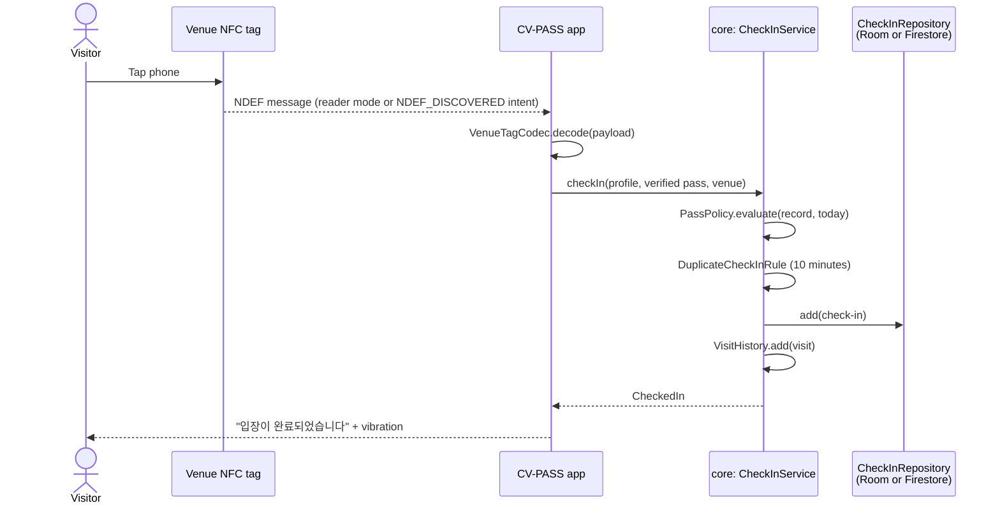
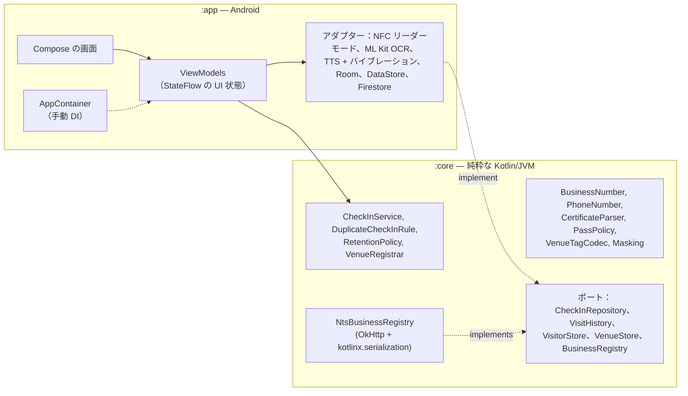

<div align="center">

🇺🇸 [English](README.md) | 🇨🇳 [简体中文](README.zh-CN.md) | 🇭🇰 [繁體中文](README.zh-HK.md) | 🇯🇵 **日本語** | 🇰🇷 [한국어](README.ko.md)


# CV-PASS

**非接触型の COVID-19 入場記録：店舗の NFC タグにタッチし、確認済みのワクチンパスを見せれば完了です。**

[](https://github.com/jumincho/covid-pass-nfc/actions/workflows/ci.yml)
[](LICENSE)
-3DDC84?logo=android&logoColor=white)


</div>

## 概要

COVID-19 のパンデミックの間、韓国ではすべての店舗が接触者追跡のために入場記録を残さなければならず、2021年末からは来店者がワクチン接種の証明を提示することも求められました。実際には手書きの名簿と QR コードが使われていましたが、入口では時間がかかり、氏名や電話番号が誰でも見られる状態で並んでいました。

CV-PASS はこれを NFC に置き換えます。店舗は入口にタグを貼り、来店者はスマートフォンでタグにタッチします。するとアプリがワクチンパスを確認し、来店を記録します。接触者追跡の担当者は、特定の日にその店舗にいた人を後から調べることができます。

このアプリは、単体テスト済みの純粋な Kotlin で書かれたドメインコアの上に、Kotlin と Jetpack Compose で構築されています。接種証明書は端末上で読み取り、店舗タグにはバージョン付きのフォーマットを使い、デフォルト設定はプライバシーを優先しています。キーがなくてもそのまま動作し、実際のバックエンドは設定で有効にします。

## 機能

### 来店者（Visitor）

- **最初に一度だけ入力する個人情報**：氏名と韓国の携帯電話番号です。入力と同時に検証され、書式が整えられます（`010-1234-5678`）。
- **ワクチンパス**（Vaccination pass）：Android の写真選択ツールで、COOV の接種証明書のスクリーンショットを選びます（ストレージの権限は不要です）。ML Kit の韓国語テキスト認識モデルが端末上でそれを読み取り、パーサーが接種者の氏名、接種回数（`1차/2차/3차 접종`、`추가 접종`）、最終接種日を抽出します。続いてポリシーが「有効」「まだ有効ではない（あと n 日）」「無効」のいずれかを、理由とともに判定します。保存するのはこうして導き出した情報だけで、画像は決して保存しません。
- **チェックイン**：チェックイン画面（Check in）を開いた状態で店舗のタグにタッチします。アプリを閉じたままでもかまいません。その場合はタグからアプリが直接開きます。「입장이 완료되었습니다」という音声（韓国語以外の端末では「Check-in complete」）とバイブレーションで完了を知らせます。10分以内にもう一度タッチしても、同じ来店として扱います。最近のチェックイン（Recent check-ins）はパス画面に一覧表示されます。

### 店舗オーナー（Venue owner）

- **事業者登録**：番号（사업자등록번호）は入力中にチェックディジットで検証します。API キーがあれば、番号、代表者名、開業日を韓国の国税庁に照会して確認します。キーがない場合、その店舗には「国税庁で未確認」（Not verified with the National Tax Service）とはっきり表示されます。
- **タグの書き込み**：店舗の情報を NFC タグに書き込みます。空のタグはフォーマットし、タグが書き込み可能か、容量が足りるかを確認します。失敗したときは、原因ごとに具体的なメッセージを表示します。
- **ダッシュボード**：今日の来店者数をリアルタイムで表示します。

### 調査員（Inspector）

- **来店記録**：調査員コード（Inspector code）を入力すると、任意の日の店舗のチェックインを照会できます。一覧では氏名と電話番号がマスクされ（`홍*동`、`010-****-5678`）、項目をタップすると詳細が表示されます。

UI はシステムのライトテーマまたはダークテーマに従い、英語と韓国語に対応し、スクリーンリーダーもサポートしています（見出し、結果を知らせるライブリージョン、ラベル付きのコントロール）。ランチャーアイコンには、Android 13 のテーマアイコン用のモノクロレイヤーがあります。

## スクリーンショット

| 役割の選択 | ワクチンパス | チェックイン完了 | NFC がオフ |
| :---: | :---: | :---: | :---: |
|  |  |  |  |
| **店舗ダッシュボード** | **調査員用の来店記録** | **ダークテーマ** | |
|  |  |  | |

これらは実機でキャプチャしたものではなく、GitHub Actions 上で Robolectric と [Roborazzi](https://github.com/takahirom/roborazzi) がサンプルデータを使って Compose の画面からレンダリングしたものです。手動で実行する Screenshots ワークフローが、これらを撮り直します。

## 仕組み

店舗タグには、2つのレコードからなる NDEF メッセージが格納されています。

| レコード | 内容 |
| --- | --- |
| MIME `application/vnd.jumincho.cvpass.venue` | UTF-8 の JSON：`{"v":1,"id":"1248100998","name":"카페 전주"}` |
| Android Application Record | `com.jumincho.cvpass`。CV-PASS が起動していなくても、タッチすればアプリが開きます |

`v` はペイロードのバージョンを表します。読み取る側は、新しいバージョンを読み違える代わりに、「アプリを更新してください」という明確なメッセージを出して拒否します。一般的なタグのメッセージは約125バイトなので、短い店舗名なら NTAG213 のシールに収まります。アプリは書き込む前に、どのタグについても容量を確認します。



パスのポリシーは [`PassPolicy`](core/src/main/kotlin/com/jumincho/cvpass/core/pass/PassPolicy.kt) の1か所にまとまっています。これは2021〜22年に適用された韓国のワクチンパス制度をモデル化したもので、初回接種（2回、またはヤンセン製ワクチンなら1回）は最終接種日の14日後から、追加接種は接種当日から有効になります。2022年1月に導入された180日の有効期限はモデル化していません。

## アーキテクチャ



- **`:core`** には重要なルールがすべて入っており、Android に依存しないため、テストが速く、コードも読みやすくなっています。生成された時点で有効であることが保証される値クラス、例外の代わりに使う sealed 型の結果、そしてストレージと国税庁への照会のためのインターフェース（「ポート」）で構成されています。
- **`:app`** は、型安全な Navigation を使うシングルアクティビティの Compose アプリです。画面は ViewModel から受け取るイミュータブルな UI 状態を描画し（単方向データフロー）、ViewModel は `:core` の型と小さなインターフェースだけに依存するので、フェイクを使って単体テストできます。NFC、ML Kit、テキスト読み上げ、Room、DataStore、Firestore といった Android のサービスは、薄いアダプターの背後に置いています。
- **依存性の注入**は手動です。`Application` 内の `AppContainer` がすべてを一度だけ組み立て、ViewModel は `viewModelFactory { initializer { … } }` で生成します。

## 技術スタック

| 分野 | 採用技術 |
| --- | --- |
| 言語とビルド | Kotlin 2.2.21、Gradle 8.14.5（Kotlin DSL、バージョンカタログ）、Android Gradle Plugin 8.13.2、KSP 2.2.21-2.0.5 |
| Android | compileSdk / targetSdk 36、minSdk 26、Java 17 バイトコード |
| UI | Jetpack Compose（BOM 2026.06.01）、Material 3 1.4、Navigation Compose 2.9.8（型安全なルート）、Lifecycle 2.10 |
| ストレージ | Room 2.8.5（来店記録と履歴）、DataStore Preferences 1.2.1（プロフィール、パスの情報、店舗）、オプションで Cloud Firestore（Firebase BoM 34.19.0） |
| OCR | ML Kit Text Recognition v2、アプリに同梱した韓国語モデル 16.0.1 |
| ネットワーク | OkHttp 5.4.0、kotlinx.serialization 1.9.0、kotlinx.coroutines 1.11.0 |
| テスト | JUnit 6（Jupiter と、Robolectric 用の vintage エンジン）、kotlin.test、kotlinx-coroutines-test、Turbine、OkHttp MockWebServer、Robolectric 4.17、Roborazzi 1.75.0 |
| CI | GitHub Actions：テスト、Android lint、デバッグ APK、シークレットスキャン、Gradle wrapper のチェックサム。手動で実行するワークフローがスクリーンショットを撮り直します |

新しい AndroidX のリリース（および OkHttp 5.5）は compileSdk 37 と Android Gradle Plugin 9.1 を必要とし、後者には Gradle 9 が必要です。そのため、バージョンカタログはあえて Gradle 8.14 のツールチェーンで動作する最新の組み合わせにとどめています。

## プロジェクト構成

```text
covid-pass-nfc/
├── .github/workflows/                     CI とスクリーンショットのワークフロー
├── app/                                   Android アプリ
│   ├── build.gradle.kts
│   ├── schemas/                           エクスポートした Room スキーマ
│   └── src/
│       ├── main/kotlin/com/jumincho/cvpass/
│       │   ├── AppConfig.kt, AppContainer.kt, CvPassApplication.kt, MainActivity.kt
│       │   ├── data/local/                Room データベースとリポジトリ
│       │   ├── data/preferences/          DataStore によるストア
│       │   ├── data/firebase/             オプションの Firestore リポジトリ
│       │   ├── nfc/                       リーダーモード、タグの読み書き
│       │   ├── ocr/                       ML Kit による接種証明書の読み取り
│       │   ├── feedback/                  テキスト読み上げとバイブレーション
│       │   └── ui/                        画面、ViewModel、テーマ、ナビゲーション
│       ├── main/res/                      英語と韓国語の文字列、アイコン
│       └── test/                          ViewModel のテストと Robolectric の画面テスト
├── core/                                  純粋な Kotlin のドメインモジュール
│   └── src/
│       ├── main/kotlin/com/jumincho/cvpass/core/
│       │   ├── business/                  BusinessNumber、国税庁（NTS）クライアント
│       │   ├── checkin/                   チェックインのサービスとルール
│       │   ├── inspector/                 調査員ゲート
│       │   ├── pass/                      接種証明書のパーサーとパスのポリシー
│       │   ├── privacy/                   マスキング
│       │   ├── venue/                     タグのコーデック、店舗の登録
│       │   └── visitor/                   電話番号、氏名、プロフィール
│       ├── test/                          単体テスト
│       └── testFixtures/                  :app のテストと共有するインメモリのフェイク
├── docs/
│   ├── presentation.pptx                  2021年のコンテストのスライド
│   └── screenshots/                       CI 上で Roborazzi がレンダリングした画面
├── firebase/firestore.rules               Firestore バックエンド用のルールの例
└── gradle/libs.versions.toml              バージョンカタログ
```

## 始め方

**必要なもの**：JDK 17 以降と、プラットフォーム 36 を含む Android SDK です（最近の Android Studio なら両方がインストールされます）。チェックインとタグの書き込みには、Android 8.0 以降で動作する NFC 対応端末が必要です。NFC のない端末でもアプリはインストールでき、その制約を説明します。

```bash
./gradlew :app:assembleDebug      # app/build/outputs/apk/debug/app-debug.apk
./gradlew :app:installDebug       # 端末を接続した状態で
```

設定をしなくても、1台の端末ですべての機能が動作します。チェックディジットが正しい任意の番号（例：`123-45-67891`）で店舗を登録し、タグに書き込み、来店者の情報を設定し、接種証明書のスクリーンショットを確認してから、タグにタッチし、調査員モードでその来店を照会してください。

### オプションの設定

プロジェクトのルートにある `local.properties`（git の管理対象外）に、次のキーを必要に応じて追加します。同じ名前の環境変数でも動作するため、CI では便利です。

| キー | 有効になる機能 | 設定しない場合 |
| --- | --- | --- |
| `BUSINESS_API_KEY` | 国税庁による事業者登録の確認。data.go.kr の「국세청_사업자등록정보 진위확인 및 상태조회 서비스」のサービスキーを使います。エンコード済みとデコード済みのどちらのキーでも動作します。 | チェックディジットだけを検証し、店舗は「国税庁で未確認」と表示されます。 |
| `INSPECTOR_PIN` | 調査員コード。 | デバッグビルドでは `0000` を使い、リリースビルドでは調査員モードが無効になります。 |
| `FIREBASE_PROJECT_ID`、`FIREBASE_APPLICATION_ID`、`FIREBASE_API_KEY` | 共有の来店記録としての Cloud Firestore。値は Firebase プロジェクトの Android アプリの設定から取得します。アプリは `FirebaseOptions` で Firebase を初期化するため、`google-services.json` は不要です。 | チェックインは端末上の Room データベースに保存されます。3つのキーをすべて設定する必要があります。 |

Firestore を使う場合、チェックインは `venues/{businessNumber}/checkins/{id}` に、`visitorName`、`phone`、`venueName`、`checkedInAt`、`date`（`yyyy-MM-dd`、日ごとの照会用）、`expireAt` のフィールドで保存されます。アプリは Firebase Authentication を実装していないため、認証なしのアクセスを許可するルールでしか動作しません。使い捨てのテスト用プロジェクトなら許容できますが、実際のデータには向きません。[`firebase/firestore.rules`](firebase/firestore.rules) は、本番環境で必要になるものを示しています。認証済みの来店者は正しい形式のエントリを追加することしかできず、調査員は信頼できるサーバーが設定するカスタムクレームで識別され、クライアントからの更新や削除はできず、保存期間の管理のために `expireAt` に TTL ポリシーを設定します。

## テスト

```bash
./gradlew :core:test                 # ドメインルール、パーサー、コーデック、NTS クライアント
./gradlew :app:testDebugUnitTest     # インメモリのフェイクを使う ViewModel テスト、Robolectric の画面テスト
./gradlew :app:lintDebug             # Android lint（警告もエラーとして扱う）
./gradlew :app:recordRoborazziDebug  # docs/screenshots を撮り直す
```

- **`:core`** には、事業者登録番号のチェックサム、電話番号と氏名の検証、マスキング、接種証明書のパーサー（ノイズ、改行、全角文字、さまざまな日付形式が混ざった合成 OCR テキストを多数使用）、パスのポリシーの境界条件、タグのコーデック（往復変換と不正なペイロード）、重複チェックインと保存期間のルール、チェックインのサービス、そして OkHttp MockWebServer を相手にした NTS クライアント（有効、不一致、キーの拒否、サーバーエラー、不正なレスポンス本文、タイムアウト、キャンセル）の単体テストがあります。
- **`:app`** には、すべての ViewModel に対する JVM の単体テストがあり、`:core` のテストフィクスチャにあるインメモリのフェイクと kotlinx-coroutines-test で動かしています。また、サンプルデータで5つの画面を描画し、主要な内容を確認する Robolectric のテストもあります。`recordRoborazziDebug` で実行すると、同じテストで上のスクリーンショットを撮影します。Screenshots ワークフローを手動で開始すると、CI 上でこれを行い、変更された画像があればコミットします。
- CI は、プッシュとプルリクエストのたびにテスト、lint、デバッグビルドを実行します。

NFC、ML Kit、テキスト読み上げ、Firestore のアダプターはプラットフォーム API の薄いラッパーで、自動テストはありません。対応するハードウェアとサービスを備えた端末が必要です。アプリは上記の単体テスト、lint、ビルドで検証していますが、NFC タグを使った実機でのエンドツーエンドの動作確認はまだ行っていません。

## プライバシーとセキュリティ

- **接種証明書は端末の外に出ません**。OCR は ML Kit に同梱されたモデルで端末上で実行され、画像とそのテキストは解析後に破棄されます。保存するのは、接種回数、初回接種に必要な回数、最終接種日、確認日時だけです。
- **最小限の記録**。チェックインに含まれるのは、来店者の氏名、電話番号、店舗、時刻だけで、接触者追跡に必要な情報に限られます。調査員向けの一覧では、項目を開くまで氏名と番号をマスクします。
- **保存期間は4週間**。2021年の韓国のガイドラインでは、入場記録は4週間後に破棄することになっていました。アプリは起動するたびに、28日より古いチェックインと来店履歴を削除します。Firestore を使う場合、`expireAt` フィールドはサーバー側の TTL ポリシーのためのものです。
- **個人データはバックアップしません**。アプリのデータについては、クラウドバックアップと端末間の転送を無効にしています。
- **調査員コードはデモ用のゲートであり、アクセス制御ではありません**。コードはアプリに組み込まれてコンパイルされるため、APK に含まれるあらゆる API キーと同様に抽出できます。実運用では、サーバー側で調査員を認証し、国税庁のキーはバックエンドの背後に置き、Firestore のルール、Authentication、App Check に頼ることになります。
- **OCR は証明になりません**。スクリーンショットを読み取るだけでは、編集された画像を見抜けません。COOV アプリ自体の QR 検証は実装していません。パスの確認は流れを示すものであり、信頼できる資格情報の確認ではありません。

## 受賞とチーム

CV-PASS は全北大学校（JBNU）のチームプロジェクトです。**2021年全北大学校（JBNU）コンピュータサイエンス学生作品コンテストの銀賞**を受賞しました（2021年11月26日）。

| 所属 | 役割 | 氏名 | 担当 |
| --- | --- | --- | --- |
| JBNU | リーダー | Lee Jeonghwan | 開発 / デザイン |
| JBNU | メンバー | Kim Yeonho | 開発 / デザイン |
| JBNU | メンバー | Jeong Jaeyoung | 開発 / デザイン |
| JBNU | メンバー | Cho Jumin | 発表 / デザイン |

- コンテストでの発表：[2021年全北大学校（JBNU）コンピュータサイエンス学生作品コンテスト（YouTube）](https://www.youtube.com/watch?v=LHE4dr8aTKQ&list=PLFAjt9goCKzyHfSKoV9AnDuxl1U9w1mLL&index=13)
- スライド：[`docs/presentation.pptx`](docs/presentation.pptx)

## ライセンス

ソースコードは [MIT ライセンス](LICENSE)で公開されています。発表スライド（`docs/presentation.pptx`）は引き続きチームの共同所有です。
