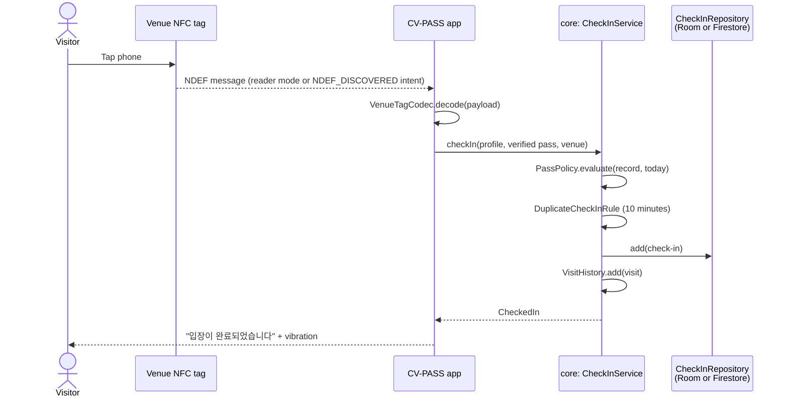
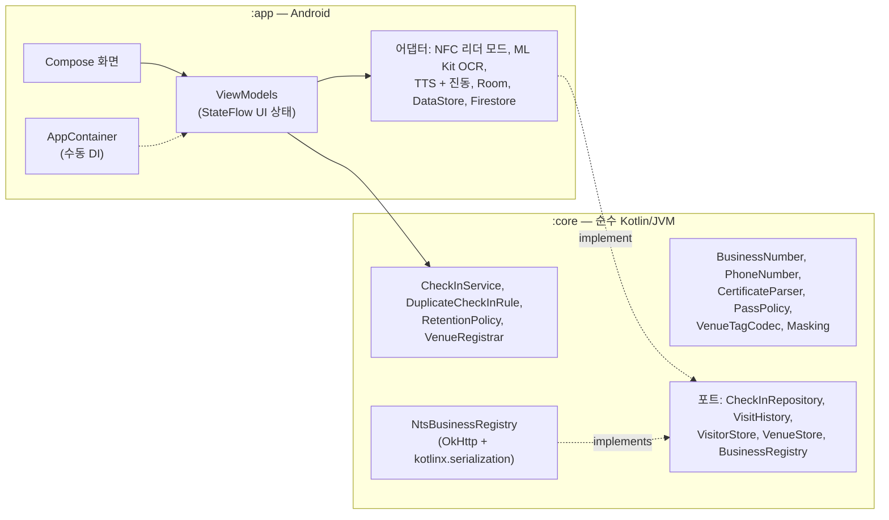

<div align="center">

🇺🇸 [English](README.md) | 🇨🇳 [简体中文](README.zh-CN.md) | 🇭🇰 [繁體中文](README.zh-HK.md) | 🇯🇵 [日本語](README.ja.md) | 🇰🇷 **한국어**


# CV-PASS

**비대면 코로나19 전자출입명부: 매장의 NFC 태그에 휴대폰을 대고, 확인된 접종 증명을 보여 주면 끝납니다.**

[](https://github.com/jumincho/covid-pass-nfc/actions/workflows/ci.yml)
[](LICENSE)
-3DDC84?logo=android&logoColor=white)


</div>

## 개요

코로나19 유행 기간에 한국의 모든 다중이용시설은 역학조사를 위해 출입명부를 관리해야 했고, 2021년 말부터는 방문자가 접종 증명도 제시해야 했습니다. 현실에서는 수기 출입명부와 QR 코드가 쓰였는데, 입구에서 시간이 걸렸고 이름과 전화번호가 누구나 볼 수 있게 드러나 있었습니다.

CV-PASS는 이를 NFC로 대체합니다. 매장은 출입구에 태그를 붙이고, 방문자가 휴대폰을 태그에 대면 앱이 접종 증명을 확인하고 방문을 기록합니다. 역학조사관은 나중에 특정 날짜에 매장을 방문한 사람을 조회할 수 있습니다.

앱은 단위 테스트를 거친 순수 Kotlin 도메인 코어 위에 Kotlin과 Jetpack Compose로 만들었습니다. 접종증명서는 기기에서 읽고, 매장 태그는 버전 정보가 담긴 형식을 쓰며, 기본 설정은 개인정보 보호를 우선합니다. 키 없이도 바로 실행되며, 실제 백엔드는 설정으로 켭니다.

## 기능

### 방문자

- **한 번만 입력하는 내 정보**: 이름과 한국 휴대폰 번호를 입력하는 즉시 검증하고 형식을 맞춥니다(`010-1234-5678`).
- **접종 증명**: Android 사진 선택 도구로 COOV 접종증명서 캡처 이미지를 고릅니다(저장소 권한 불필요). ML Kit의 한국어 텍스트 인식 모델이 기기에서 이미지를 읽고, 파서가 접종자 이름, 접종 차수(`1차/2차/3차 접종`, `추가 접종`), 마지막 접종일을 추출합니다. 이어서 판정 규칙이 *유효*, *아직 유효하지 않음(n일 남음)*, *유효하지 않음* 중 하나를 사유와 함께 정합니다. 이렇게 도출한 정보만 저장하며, 이미지는 절대 저장하지 않습니다.
- **입장**: 입장하기 화면을 연 상태에서 매장 태그에 휴대폰을 대면 됩니다. 앱이 닫혀 있어도 되며, 이때는 태그가 앱을 바로 엽니다. "입장이 완료되었습니다"라는 음성 안내(한국어가 아닌 기기에서는 "Check-in complete")와 진동으로 입장을 확인해 줍니다. 10분 안에 다시 태그하면 같은 방문으로 처리됩니다. 최근 입장 기록은 접종 증명 화면에 표시됩니다.

### 사업주

- **사업자등록**: 사업자등록번호는 입력하는 동안 검증 번호로 확인합니다. API 키가 있으면 번호, 대표자명, 개업일자를 국세청을 통해 확인하고, 키가 없으면 매장에 *국세청 미확인* 표시가 분명하게 붙습니다.
- **NFC 태그 만들기**: 매장 정보를 NFC 태그에 기록합니다. 빈 태그는 포맷하고, 태그가 쓰기 가능한지와 용량이 충분한지 확인하며, 실패하면 원인별로 구체적인 메시지를 보여 줍니다.
- **매장 현황**: 오늘 방문자 수를 실시간으로 보여 줍니다.

### 역학조사관

- **출입 기록**: 조사관 코드를 입력하면 원하는 날짜의 매장 출입 기록을 조회할 수 있습니다. 목록에서는 이름과 전화번호가 마스킹되고(`홍*동`, `010-****-5678`), 항목을 누르면 상세 정보가 표시됩니다.

UI는 시스템의 밝은 테마 또는 어두운 테마를 따르고, 영어와 한국어로 제공되며, 스크린 리더를 지원합니다(제목, 결과를 알리는 라이브 리전, 레이블이 붙은 컨트롤). 런처 아이콘에는 Android 13 테마 아이콘을 위한 단색 레이어가 있습니다.

## 스크린샷

| 역할 선택 | 접종 증명 | 입장 완료 | NFC 꺼짐 |
| :---: | :---: | :---: | :---: |
|  |  |  |  |
| **매장 현황** | **역학조사관 출입 기록** | **어두운 테마** | |
|  |  |  | |

이 스크린샷은 기기에서 캡처한 것이 아니라, GitHub Actions에서 Robolectric과 [Roborazzi](https://github.com/takahirom/roborazzi)가 샘플 데이터로 Compose 화면을 렌더링한 것입니다. 수동으로 실행하는 Screenshots 워크플로가 이를 다시 생성합니다.

## 동작 방식

매장 태그에는 레코드 두 개로 이루어진 NDEF 메시지가 들어 있습니다.

| 레코드 | 내용 |
| --- | --- |
| MIME `application/vnd.jumincho.cvpass.venue` | UTF-8 JSON: `{"v":1,"id":"1248100998","name":"카페 전주"}` |
| Android Application Record | `com.jumincho.cvpass`. CV-PASS가 실행 중이 아니어도 태그에 대면 앱이 열립니다 |

`v`는 페이로드의 버전을 나타냅니다. 읽는 쪽은 더 새로운 버전을 잘못 해석하지 않고 "앱을 업데이트하라"는 분명한 메시지와 함께 거부합니다. 일반적인 태그 메시지는 약 125바이트여서 짧은 매장 이름이라면 NTAG213 스티커에 들어갑니다. 앱은 기록하기 전에 모든 태그의 용량을 확인합니다.



접종 증명 판정 규칙은 [`PassPolicy`](core/src/main/kotlin/com/jumincho/cvpass/core/pass/PassPolicy.kt) 한곳에 모여 있습니다. 이 규칙은 2021~22년에 적용된 한국의 방역패스 규정을 모델링합니다. 기본접종(2회, 얀센은 1회)은 마지막 접종일로부터 14일이 지나면 유효하고, 추가 접종은 접종 당일부터 유효합니다. 2022년 1월에 도입된 180일 유효기간은 반영하지 않았습니다.

## 아키텍처



- **`:core` 모듈**은 중요한 규칙을 모두 담고 있으며 Android에 의존하지 않으므로, 테스트가 빠르고 읽기 쉽습니다. 생성되는 순간부터 유효함이 보장되는 값 클래스, 예외 대신 쓰는 sealed 결과 타입, 그리고 데이터 저장과 국세청 조회를 위한 인터페이스("포트")로 이루어져 있습니다.
- **`:app` 모듈**은 타입 안전한 Navigation을 쓰는 단일 액티비티 Compose 앱입니다. 화면은 ViewModel이 내보내는 불변 UI 상태를 렌더링하고(단방향 데이터 흐름), ViewModel은 `:core` 타입과 작은 인터페이스에만 의존하므로 페이크로 단위 테스트합니다. NFC, ML Kit, 텍스트 음성 변환, Room, DataStore, Firestore 같은 Android 서비스는 얇은 어댑터 뒤에 있습니다.
- **의존성 주입**은 수동으로 합니다. `Application`의 `AppContainer`가 모든 객체를 한 번만 만들고, ViewModel은 `viewModelFactory { initializer { … } }`로 생성합니다.

## 기술 스택

| 영역 | 선택 |
| --- | --- |
| 언어와 빌드 | Kotlin 2.2.21, Gradle 8.14.5 (Kotlin DSL, 버전 카탈로그), Android Gradle Plugin 8.13.2, KSP 2.2.21-2.0.5 |
| Android | compileSdk / targetSdk 36, minSdk 26, Java 17 바이트코드 |
| UI | Jetpack Compose (BOM 2026.06.01), Material 3 1.4, Navigation Compose 2.9.8 (타입 안전한 라우트), Lifecycle 2.10 |
| 데이터 저장 | Room 2.8.5 (출입 기록과 방문 기록), DataStore Preferences 1.2.1 (프로필, 접종 증명 정보, 매장), 선택 사항으로 Cloud Firestore (Firebase BoM 34.19.0) |
| OCR | ML Kit Text Recognition v2, 앱에 포함된 한국어 모델 16.0.1 |
| 네트워크 | OkHttp 5.4.0, kotlinx.serialization 1.9.0, kotlinx.coroutines 1.11.0 |
| 테스트 | JUnit 6 (Jupiter, 그리고 Robolectric용 vintage 엔진), kotlin.test, kotlinx-coroutines-test, Turbine, OkHttp MockWebServer, Robolectric 4.17, Roborazzi 1.75.0 |
| CI | GitHub Actions: 테스트, Android lint, 디버그 APK, 시크릿 검사, Gradle wrapper 체크섬. 수동으로 실행하는 워크플로가 스크린샷을 다시 생성합니다 |

더 새로운 AndroidX 릴리스(그리고 OkHttp 5.5)는 compileSdk 37과 Android Gradle Plugin 9.1을 요구하고, 이 플러그인에는 Gradle 9가 필요합니다. 그래서 버전 카탈로그는 Gradle 8.14 툴체인에서 동작하는 가장 최신 조합에 일부러 머물러 있습니다.

## 프로젝트 구조

```text
covid-pass-nfc/
├── .github/workflows/                     CI 및 스크린샷 워크플로
├── app/                                   Android 앱
│   ├── build.gradle.kts
│   ├── schemas/                           내보낸 Room 스키마
│   └── src/
│       ├── main/kotlin/com/jumincho/cvpass/
│       │   ├── AppConfig.kt, AppContainer.kt, CvPassApplication.kt, MainActivity.kt
│       │   ├── data/local/                Room 데이터베이스와 저장소
│       │   ├── data/preferences/          DataStore 기반 저장소
│       │   ├── data/firebase/             선택 사항인 Firestore 저장소
│       │   ├── nfc/                       리더 모드, 태그 읽기와 쓰기
│       │   ├── ocr/                       ML Kit 접종증명서 판독기
│       │   ├── feedback/                  텍스트 음성 변환과 진동
│       │   └── ui/                        화면, ViewModel, 테마, 내비게이션
│       ├── main/res/                      영어·한국어 문자열, 아이콘
│       └── test/                          ViewModel 테스트와 Robolectric 화면 테스트
├── core/                                  순수 Kotlin 도메인 모듈
│   └── src/
│       ├── main/kotlin/com/jumincho/cvpass/core/
│       │   ├── business/                  BusinessNumber, 국세청(NTS) 클라이언트
│       │   ├── checkin/                   입장 처리 서비스와 규칙
│       │   ├── inspector/                 조사관 코드 확인
│       │   ├── pass/                      접종증명서 파서와 판정 규칙
│       │   ├── privacy/                   마스킹
│       │   ├── venue/                     태그 코덱, 매장 등록
│       │   └── visitor/                   전화번호, 이름, 프로필
│       ├── test/                          단위 테스트
│       └── testFixtures/                  :app 테스트와 공유하는 인메모리 페이크
├── docs/
│   ├── presentation.pptx                  2021년 경진대회 발표 슬라이드
│   └── screenshots/                       Roborazzi가 CI에서 렌더링한 화면
├── firebase/firestore.rules               Firestore 백엔드용 예시 규칙
└── gradle/libs.versions.toml              버전 카탈로그
```

## 시작하기

**요구 사항**: JDK 17 이상, 그리고 플랫폼 36이 설치된 Android SDK가 필요합니다(최신 Android Studio를 설치하면 둘 다 설치됩니다). 입장과 태그 기록에는 Android 8.0 이상이 설치된 NFC 지원 기기가 필요합니다. NFC가 없는 기기에도 앱은 설치되며, 이 제약을 안내합니다.

```bash
./gradlew :app:assembleDebug      # app/build/outputs/apk/debug/app-debug.apk
./gradlew :app:installDebug       # 기기를 연결한 상태에서
```

설정 없이도 기기 한 대에서 모든 기능이 동작합니다. 검증 번호가 올바른 아무 번호(예: `123-45-67891`)로 매장을 등록하고, 태그를 만들고, 방문자 정보를 등록하고, 접종증명서 캡처 이미지를 확인한 다음, 태그에 휴대폰을 대고, 조사관 모드에서 방문 기록을 조회해 보면 됩니다.

### 선택 설정

프로젝트 루트의 `local.properties`(git에서 무시됨)에 아래 키를 필요한 만큼 추가합니다. 같은 이름의 환경 변수도 쓸 수 있어 CI에서 편리합니다.

| 키 | 활성화되는 기능 | 키가 없을 때 |
| --- | --- | --- |
| `BUSINESS_API_KEY` | 국세청을 통한 사업자등록정보 진위확인. data.go.kr의 "국세청_사업자등록정보 진위확인 및 상태조회 서비스" 서비스 키를 사용합니다. 인코딩된 키와 디코딩된 키 모두 사용할 수 있습니다. | 검증 번호만 확인하며, 매장은 *국세청 미확인*으로 표시됩니다. |
| `INSPECTOR_PIN` | 조사관 코드. | 디버그 빌드는 `0000`을 사용하고, 릴리스 빌드에서는 조사관 모드를 사용할 수 없습니다. |
| `FIREBASE_PROJECT_ID`, `FIREBASE_APPLICATION_ID`, `FIREBASE_API_KEY` | 공유 출입 기록으로 Cloud Firestore를 사용합니다. 값은 Firebase 프로젝트의 Android 앱 설정에서 가져옵니다. 앱이 `FirebaseOptions`로 Firebase를 초기화하므로 `google-services.json`은 필요하지 않습니다. | 입장 기록은 기기의 Room 데이터베이스에 저장됩니다. 세 키를 모두 설정해야 합니다. |

Firestore를 사용하면 입장 기록은 `venues/{businessNumber}/checkins/{id}`에 `visitorName`, `phone`, `venueName`, `checkedInAt`, `date`(`yyyy-MM-dd`, 날짜별 조회용), `expireAt` 필드로 저장됩니다. 앱은 Firebase Authentication을 구현하지 않으므로 인증되지 않은 접근을 허용하는 규칙에서만 동작합니다. 버려도 되는 테스트 프로젝트라면 괜찮지만 실제 데이터에는 적합하지 않습니다. [`firebase/firestore.rules`](firebase/firestore.rules)는 프로덕션에 필요한 것을 보여 줍니다. 인증된 방문자는 형식이 올바른 항목을 추가만 할 수 있고, 역학조사관은 신뢰할 수 있는 서버가 설정한 커스텀 클레임으로 식별하며, 클라이언트의 수정과 삭제는 허용하지 않고, 보존 기간 관리를 위해 `expireAt`에 TTL 정책을 둡니다.

## 테스트

```bash
./gradlew :core:test                 # 도메인 규칙, 파서, 코덱, NTS 클라이언트
./gradlew :app:testDebugUnitTest     # 인메모리 페이크를 쓰는 ViewModel 테스트, Robolectric 화면 테스트
./gradlew :app:lintDebug             # Android lint, 경고도 오류로 처리
./gradlew :app:recordRoborazziDebug  # docs/screenshots 다시 생성
```

- **`:core` 모듈**에는 사업자등록번호 체크섬, 전화번호와 이름 검증, 마스킹, 접종증명서 파서(노이즈, 줄바꿈, 전각 문자, 여러 날짜 형식이 섞인 합성 OCR 텍스트 다수), 판정 규칙의 경계 조건, 태그 코덱(왕복 변환과 잘못된 페이로드), 중복 입장 규칙과 보존 기간 규칙, 입장 처리 서비스, 그리고 OkHttp MockWebServer를 상대로 한 NTS 클라이언트(유효, 불일치, 키 거부, 서버 오류, 잘못된 응답 본문, 시간 초과, 취소)에 대한 단위 테스트가 있습니다.
- **`:app` 모듈**에는 모든 ViewModel에 대한 JVM 단위 테스트가 있으며, `:core` 테스트 픽스처의 인메모리 페이크와 kotlinx-coroutines-test로 구동합니다. 또 샘플 데이터로 화면 다섯 개를 렌더링하고 핵심 내용을 확인하는 Robolectric 테스트가 있습니다. `recordRoborazziDebug`로 실행하면 같은 테스트가 위의 스크린샷을 기록합니다. Screenshots 워크플로를 수동으로 시작하면 CI에서 이 작업을 하고, 바뀐 이미지가 있으면 커밋합니다.
- CI는 푸시와 풀 리퀘스트마다 테스트, lint, 디버그 빌드를 실행합니다.

NFC, ML Kit, 텍스트 음성 변환, Firestore 어댑터는 플랫폼 API를 감싼 얇은 래퍼여서 자동화된 테스트가 없으며, 해당 하드웨어와 서비스를 갖춘 기기가 필요합니다. 앱은 위의 단위 테스트, lint, 빌드로 검증했으며, NFC 태그와 실제 기기로 처음부터 끝까지 검증한 적은 아직 없습니다.

## 개인정보 보호와 보안

- **접종증명서는 기기 밖으로 나가지 않습니다.** OCR은 ML Kit에 포함된 모델로 기기에서 실행되며, 이미지와 그 텍스트는 파싱 후 폐기합니다. 접종 횟수, 기본접종에 필요한 횟수, 마지막 접종일, 확인 시각만 저장합니다.
- **최소한의 기록.** 입장 기록에는 역학조사에 필요한 방문자의 이름, 전화번호, 매장, 시각만 담깁니다. 역학조사관이 보는 목록에서는 항목을 열기 전까지 이름과 번호를 마스킹합니다.
- **4주 보관.** 2021년 한국의 지침에 따르면 출입명부는 4주 뒤 파기해야 했습니다. 앱은 실행할 때마다 28일이 지난 입장 기록과 방문 기록을 삭제합니다. Firestore를 쓰는 경우 `expireAt` 필드는 서버 측 TTL 정책에 쓰기 위한 것입니다.
- **개인정보는 백업하지 않습니다.** 앱 데이터의 클라우드 백업과 기기 간 전송을 사용 중지했습니다.
- **조사관 코드는 접근 통제가 아니라 데모용 확인 절차입니다.** 코드는 앱에 컴파일되어 들어가므로, APK에 든 모든 API 키와 마찬가지로 추출할 수 있습니다. 실제로 운영하려면 서버에서 역학조사관을 인증하고, 국세청 키는 백엔드 뒤에 두고, Firestore 규칙, Authentication, App Check에 의존해야 합니다.
- **OCR은 증명이 아닙니다.** 캡처 이미지를 읽는 것만으로는 편집된 이미지를 가려낼 수 없으며, COOV 앱 자체의 QR 검증은 구현하지 않았습니다. 접종 증명 확인은 흐름을 보여 줄 뿐, 믿을 수 있는 자격 증명 검증이 아닙니다.

## 수상과 팀

CV-PASS는 전북대학교(JBNU)의 팀 프로젝트입니다. **2021년 전북대학교 컴퓨터공학부 작품경진대회 은상**을 받았습니다(2021년 11월 26일).

| 소속 | 역할 | 이름 | 담당 |
| --- | --- | --- | --- |
| 전북대 | 팀장 | 이정환 | 개발 / 디자인 |
| 전북대 | 팀원 | 김연호 | 개발 / 디자인 |
| 전북대 | 팀원 | 정재영 | 개발 / 디자인 |
| 전북대 | 팀원 | 조주민 | 발표 / 디자인 |

- 경진대회 발표: [2021년 전북대학교 컴퓨터공학부 작품경진대회(YouTube)](https://www.youtube.com/watch?v=LHE4dr8aTKQ&list=PLFAjt9goCKzyHfSKoV9AnDuxl1U9w1mLL&index=13)
- 발표 슬라이드: [`docs/presentation.pptx`](docs/presentation.pptx)

## 라이선스

소스 코드는 [MIT 라이선스](LICENSE)로 공개됩니다. 발표 슬라이드(`docs/presentation.pptx`)는 팀의 공동 소유로 남아 있습니다.
