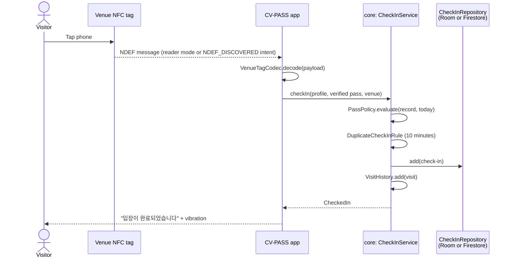
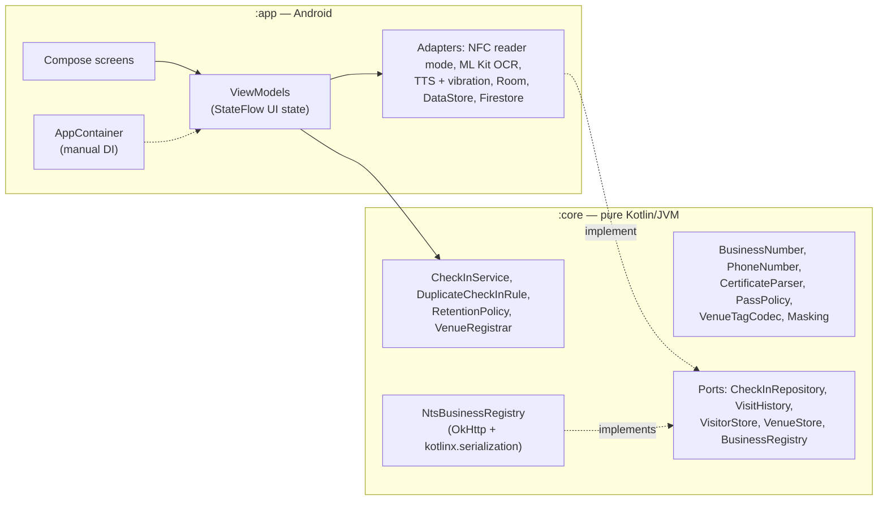

<div align="center">

🇺🇸 **English** | 🇨🇳 [简体中文](README.zh-CN.md) | 🇭🇰 [繁體中文](README.zh-HK.md) | 🇯🇵 [日本語](README.ja.md) | 🇰🇷 [한국어](README.ko.md)


# CV-PASS

**Contactless COVID-19 entry logs: tap a venue's NFC tag, show a verified vaccination pass, done.**

[](https://github.com/jumincho/covid-pass-nfc/actions/workflows/ci.yml)
[](LICENSE)
-3DDC84?logo=android&logoColor=white)


</div>

## Overview

During the COVID-19 pandemic, every venue in Korea had to keep an entry log for contact
tracing, and from late 2021 visitors also had to show proof of vaccination. In practice that
meant handwritten sign-in sheets and QR codes: slow at the door, and full of names and phone
numbers left in the open.

CV-PASS replaces that with NFC. A venue sticks a tag at its entrance; a visitor taps it with
their phone, and the app checks their vaccination pass and logs the visit. Contact tracers can
later look up who was at a venue on a given day.

The app is built with Kotlin and Jetpack Compose on a unit-tested, pure-Kotlin domain core:
certificates are read on the device, venue tags use a versioned format, and the defaults favour
privacy. It runs out of the box without any keys; real backends are switched on through
configuration.

## Features

### Visitor

- **One-time details**: name and Korean mobile number, validated and formatted as you type
  (`010-1234-5678`).
- **Vaccination pass**: pick a screenshot of the COOV certificate with the Android photo picker
  (no storage permission). ML Kit's Korean text-recognition model reads it on the device; a
  parser extracts the holder's name, dose number (`1차/2차/3차 접종`, `추가 접종`) and the date of
  the last dose, and a policy decides *valid*, *not yet valid (n days to go)* or *not valid* with
  a reason. Only those derived facts are stored, never the image.
- **Check-in**: tap the venue's tag while the check-in screen is open, or with the app closed —
  the tag opens the app directly. A spoken "입장이 완료되었습니다" (or "Check-in complete" on
  non-Korean devices) and a vibration confirm it. A second tap within 10 minutes counts as the
  same visit. Recent check-ins are listed on the pass screen.

### Venue owner

- **Business registration**: the number (사업자등록번호) is checked against its check digit as
  it is typed. With an API key, the number, representative's name and opening date are
  confirmed with the National Tax Service; without one, the venue is clearly marked
  *not verified with the National Tax Service*.
- **Tag writing**: writes the venue to an NFC tag, formatting blank tags and checking that the
  tag is writable and large enough, with a specific message for each failure.
- **Dashboard**: today's visitor count, updated live.

### Inspector

- **Visitor log**: after entering the inspector code, look up a venue's check-ins for any day.
  Names and phone numbers are masked in the list (`홍*동`, `010-****-5678`); tapping an entry
  reveals its details.

The UI follows the system's light or dark theme, is available in English and Korean, and
supports screen readers (headings, live regions for results, labelled controls). The launcher
icon has a monochrome layer for Android 13 themed icons.

## Screenshots

| Role chooser | Vaccination pass | Check-in complete | NFC turned off |
| :---: | :---: | :---: | :---: |
|  |  |  |  |
| **Venue dashboard** | **Inspector log** | **Dark theme** | |
|  |  |  | |

These are rendered from the Compose screens with sample data by Robolectric and
[Roborazzi](https://github.com/takahirom/roborazzi) on GitHub Actions, not captured on a device;
the manually run Screenshots workflow re-records them.

## How it works

A venue tag holds an NDEF message with two records:

| Record | Content |
| --- | --- |
| MIME `application/vnd.jumincho.cvpass.venue` | UTF-8 JSON: `{"v":1,"id":"1248100998","name":"카페 전주"}` |
| Android Application Record | `com.jumincho.cvpass`, so that a tap opens CV-PASS even when it is not running |

`v` versions the payload: readers reject newer versions with a clear "update the app" message
instead of misreading them. A typical tag message is about 125 bytes, so short venue names fit
an NTAG213 sticker; the app checks every tag's capacity before writing.



The pass policy lives in one place, [`PassPolicy`](core/src/main/kotlin/com/jumincho/cvpass/core/pass/PassPolicy.kt).
It models Korea's vaccine-pass rule as applied in 2021–22: the primary series (two doses, or
one of Janssen) counts from 14 days after its last dose, and a booster counts from the day it
is given. The 180-day expiry introduced in January 2022 is not modelled.

## Architecture



- **`:core`** holds every rule that matters and has no Android dependency, so it is fast to
  test and easy to read: value classes that are valid by construction, sealed results instead
  of exceptions, and interfaces ("ports") for storage and the tax-service lookup.
- **`:app`** is a single-activity Compose app with type-safe Navigation. Screens render
  immutable UI state from ViewModels (unidirectional data flow); ViewModels depend only on
  `:core` types and small interfaces, so they are unit-tested with fakes. Android services —
  NFC, ML Kit, text-to-speech, Room, DataStore and Firestore — sit behind thin adapters.
- **Dependency injection** is manual: `AppContainer` in the `Application` builds everything
  once, and ViewModels are created with `viewModelFactory { initializer { … } }`.

## Tech stack

| Area | Choice |
| --- | --- |
| Language and build | Kotlin 2.2.21, Gradle 8.14.5 (Kotlin DSL, version catalog), Android Gradle Plugin 8.13.2, KSP 2.2.21-2.0.5 |
| Android | compileSdk / targetSdk 36, minSdk 26, Java 17 bytecode |
| UI | Jetpack Compose (BOM 2026.06.01), Material 3 1.4, Navigation Compose 2.9.8 (type-safe routes), Lifecycle 2.10 |
| Storage | Room 2.8.5 (visitor log and history), DataStore Preferences 1.2.1 (profile, pass facts, venue); optional Cloud Firestore (Firebase BoM 34.19.0) |
| OCR | ML Kit Text Recognition v2, bundled Korean model 16.0.1 |
| Networking | OkHttp 5.4.0, kotlinx.serialization 1.9.0, kotlinx.coroutines 1.11.0 |
| Testing | JUnit 6 (Jupiter, plus the vintage engine for Robolectric), kotlin.test, kotlinx-coroutines-test, Turbine, OkHttp MockWebServer, Robolectric 4.17, Roborazzi 1.75.0 |
| CI | GitHub Actions: tests, Android lint, debug APK, secret scan, Gradle wrapper checksum; a manually run workflow re-records the screenshots |

Newer AndroidX releases (and OkHttp 5.5) require compileSdk 37 and Android Gradle Plugin 9.1,
which needs Gradle 9; the catalog deliberately stays on the newest set that works with the
Gradle 8.14 toolchain.

## Project structure

```text
covid-pass-nfc/
├── .github/workflows/                     CI and screenshot workflows
├── app/                                   Android app
│   ├── build.gradle.kts
│   ├── schemas/                           Exported Room schema
│   └── src/
│       ├── main/kotlin/com/jumincho/cvpass/
│       │   ├── AppConfig.kt, AppContainer.kt, CvPassApplication.kt, MainActivity.kt
│       │   ├── data/local/                Room database and repositories
│       │   ├── data/preferences/          DataStore stores
│       │   ├── data/firebase/             Optional Firestore repository
│       │   ├── nfc/                       Reader mode, tag reading and writing
│       │   ├── ocr/                       ML Kit certificate reader
│       │   ├── feedback/                  Text-to-speech and vibration
│       │   └── ui/                        Screens, ViewModels, theme, navigation
│       ├── main/res/                      English and Korean strings, icons
│       └── test/                          ViewModel and Robolectric screen tests
├── core/                                  Pure Kotlin domain module
│   └── src/
│       ├── main/kotlin/com/jumincho/cvpass/core/
│       │   ├── business/                  BusinessNumber, NTS client
│       │   ├── checkin/                   Check-in service and rules
│       │   ├── inspector/                 Inspector gate
│       │   ├── pass/                      Certificate parser and pass policy
│       │   ├── privacy/                   Masking
│       │   ├── venue/                     Tag codec, venue registration
│       │   └── visitor/                   Phone number, name, profile
│       ├── test/                          Unit tests
│       └── testFixtures/                  In-memory fakes shared with :app tests
├── docs/
│   ├── presentation.pptx                  2021 competition slides
│   └── screenshots/                       Screens rendered on CI by Roborazzi
├── firebase/firestore.rules               Example rules for the Firestore backend
└── gradle/libs.versions.toml              Version catalog
```

## Getting started

**Requirements**: JDK 17 or newer and the Android SDK with platform 36 (a recent Android
Studio installs both). Checking in and writing tags needs an NFC-capable device running
Android 8.0 or newer; on devices without NFC the app still installs and explains the
limitation.

```bash
./gradlew :app:assembleDebug      # app/build/outputs/apk/debug/app-debug.apk
./gradlew :app:installDebug       # with a device connected
```

Everything works on a single device without configuration: register a venue with any number
that has a valid check digit (for example `123-45-67891`), write a tag, set up a visitor,
verify a certificate screenshot, tap the tag, and look the visit up in inspector mode.

### Optional configuration

Add any of these keys to `local.properties` in the project root (git-ignored); environment
variables of the same name also work, which is convenient on CI.

| Key | Enables | Without it |
| --- | --- | --- |
| `BUSINESS_API_KEY` | National Tax Service verification of business registrations. Use the service key of "국세청_사업자등록정보 진위확인 및 상태조회 서비스" from data.go.kr; the encoded and decoded variants both work. | Only the check digit is validated, and the venue is shown as *not verified with the National Tax Service*. |
| `INSPECTOR_PIN` | The inspector code. | Debug builds use `0000`; release builds disable inspector mode. |
| `FIREBASE_PROJECT_ID`, `FIREBASE_APPLICATION_ID`, `FIREBASE_API_KEY` | Cloud Firestore as the shared visitor log. Take the values from your Firebase project's Android app settings; no `google-services.json` is needed because the app initialises Firebase with `FirebaseOptions`. | Check-ins stay in the Room database on the device. All three keys must be set. |

With Firestore, check-ins are stored at `venues/{businessNumber}/checkins/{id}` with the
fields `visitorName`, `phone`, `venueName`, `checkedInAt`, `date` (`yyyy-MM-dd`, for per-day
queries) and `expireAt`. The app does not implement Firebase Authentication, so it only works
against rules that allow unauthenticated access — acceptable for a throwaway test project, not
for real data. [`firebase/firestore.rules`](firebase/firestore.rules) shows what production
needs: authenticated visitors that can only append well-formed entries, inspectors identified
by a custom claim set from a trusted server, no client updates or deletes, and a TTL policy on
`expireAt` for retention.

## Testing

```bash
./gradlew :core:test                 # domain rules, parser, codec, NTS client
./gradlew :app:testDebugUnitTest     # ViewModels with in-memory fakes, Robolectric screen tests
./gradlew :app:lintDebug             # Android lint, warnings treated as errors
./gradlew :app:recordRoborazziDebug  # re-record docs/screenshots
```

- **`:core`** has unit tests for the business-number checksum, phone and name validation,
  masking, the certificate parser (many synthetic OCR texts with noise, line breaks,
  full-width characters and mixed date formats), pass-policy boundaries, the tag codec
  (round-trips and malformed payloads), the duplicate and retention rules, the check-in
  service, and the NTS client against OkHttp MockWebServer (valid, not matched, rejected key,
  server error, malformed body, timeout, cancellation).
- **`:app`** has JVM unit tests for every ViewModel, driven by the in-memory fakes from
  `:core`'s test fixtures and kotlinx-coroutines-test, and Robolectric tests that render five
  screens with sample data and check their key content. Run with `recordRoborazziDebug`, the
  same tests record the screenshots above; the Screenshots workflow does that on CI when it is
  started by hand and commits any changed images.
- CI runs the tests, lint and a debug build on every push and pull request.

The NFC, ML Kit, text-to-speech and Firestore adapters are thin wrappers around platform APIs
and have no automated tests; they need a device with the corresponding hardware and services.
The app is verified by the unit tests, lint and builds above; it has not yet been exercised
end to end on a physical device with NFC tags.

## Privacy and security

- **Certificates stay on the device.** OCR runs locally with ML Kit's bundled model; the image
  and its text are discarded after parsing. Only the dose count, the doses the primary series
  needs, the last dose date and the verification time are stored.
- **Minimal logs.** A check-in holds the visitor's name, phone number, venue and time — what
  contact tracing needs. Inspector lists mask names and numbers until an entry is opened.
- **Four-week retention.** Korean guidance in 2021 was to destroy entry logs after four
  weeks. The app deletes check-ins and visits older than 28 days on every start; with
  Firestore, the `expireAt` field is meant for a server-side TTL policy.
- **No backups of personal data.** Cloud backup and device-to-device transfer are disabled
  for the app's data.
- **The inspector code is a demo gate, not access control.** It is compiled into the app and
  can be extracted, as can any API key in an APK. A real deployment would authenticate
  inspectors on a server, keep the National Tax Service key behind a backend, and rely on
  Firestore rules, Authentication and App Check.
- **OCR is not proof.** Reading a screenshot cannot detect an edited image; the COOV app's
  own QR verification is not implemented. The pass check shows the flow, not a trustworthy
  credential check.

## Award and team

CV-PASS is a team project from Jeonbuk National University (JBNU). It received the **silver
award at the 2021 JBNU CS Student Project Competition** (November 26, 2021).

| Affiliation | Role | Name | Responsibility |
| --- | --- | --- | --- |
| JBNU | Lead | Lee Jeonghwan | Development / Design |
| JBNU | Member | Kim Yeonho | Development / Design |
| JBNU | Member | Jeong Jaeyoung | Development / Design |
| JBNU | Member | Cho Jumin | Presentation / Design |

- Competition presentation: [2021 JBNU CS Student Project Competition (YouTube)](https://www.youtube.com/watch?v=LHE4dr8aTKQ&list=PLFAjt9goCKzyHfSKoV9AnDuxl1U9w1mLL&index=13)
- Slides: [`docs/presentation.pptx`](docs/presentation.pptx)

## License

The source code is released under the [MIT License](LICENSE). The presentation slides
(`docs/presentation.pptx`) remain jointly owned by the team.
