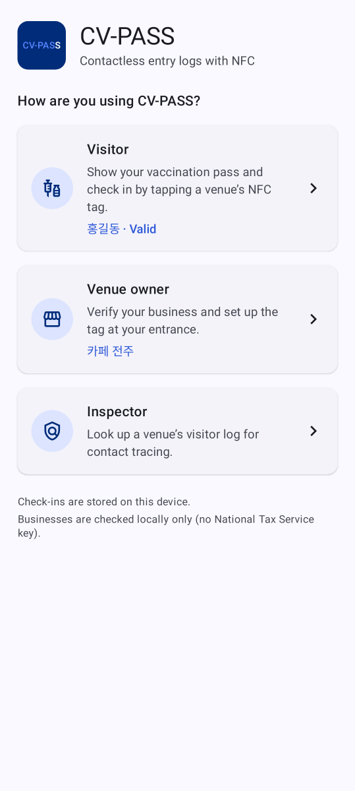
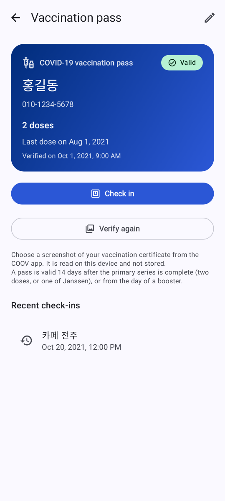
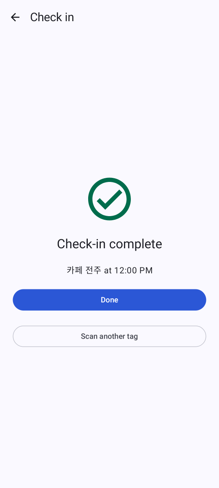
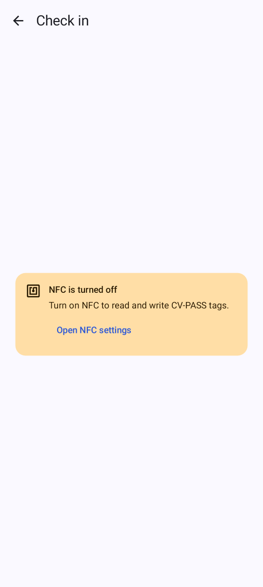
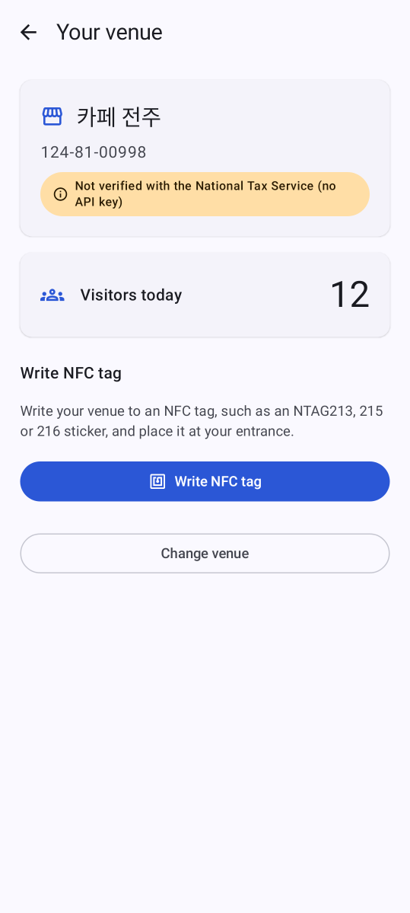
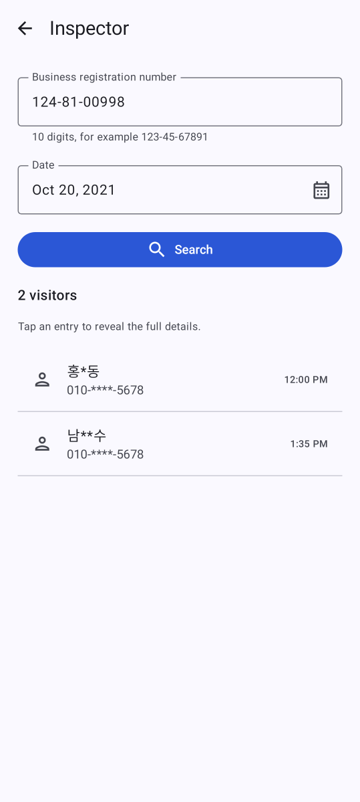
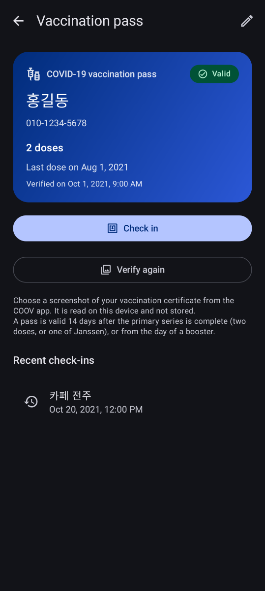
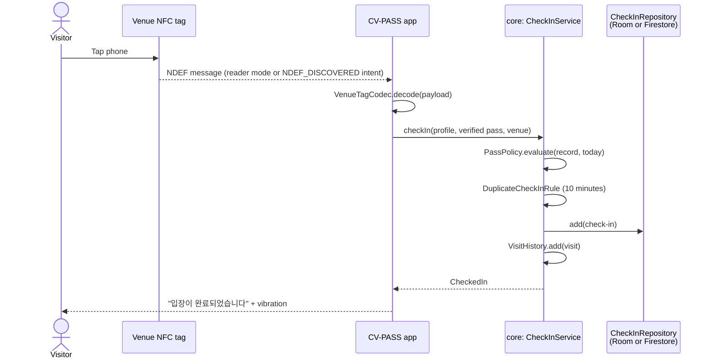
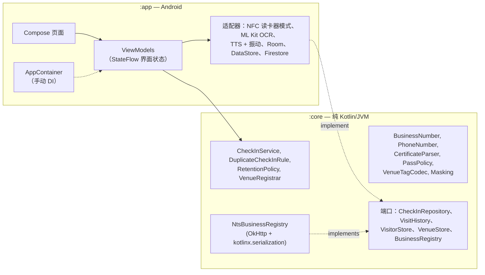

<div align="center">

🇺🇸 [English](README.md) | 🇨🇳 **简体中文** | 🇭🇰 [繁體中文](README.zh-HK.md) | 🇯🇵 [日本語](README.ja.md) | 🇰🇷 [한국어](README.ko.md)


# CV-PASS

**无接触式 COVID-19 出入登记：触碰场所的 NFC 标签，出示已验证的疫苗通行证，即可完成。**

[](https://github.com/jumincho/covid-pass-nfc/actions/workflows/ci.yml)
[](LICENSE)
-3DDC84?logo=android&logoColor=white)


</div>

## 概述

COVID-19 疫情期间，韩国的每个场所都必须为流行病学调查保留出入登记记录；从 2021 年底起，访客还必须出示疫苗接种证明。实际做法就是手写签到表和二维码：门口通行缓慢，姓名和电话号码还大量暴露在外。

CV-PASS 用 NFC 取代了这些做法。场所在入口处贴上一个标签；访客用手机触碰标签，应用便会检查其疫苗通行证并记录这次到访。流调人员之后可以查询某一天有哪些人到过某个场所。

本应用使用 Kotlin 和 Jetpack Compose 构建，底层是经过单元测试的纯 Kotlin 领域核心：接种证明在设备上读取，场所标签采用带版本号的格式，默认设置优先保护隐私。无需任何密钥，开箱即可运行；真实的后端通过配置启用。

## 功能

### 访客（Visitor）

- **一次性填写个人信息**：姓名和韩国手机号码，输入时即时校验并自动格式化（`010-1234-5678`）。
- **疫苗通行证**（Vaccination pass）：通过 Android 照片选择器选取 COOV 接种证明的截图（无需存储权限）。ML Kit 的韩语文字识别模型在设备上读取截图；解析器从中提取持有人姓名、接种剂次（`1차/2차/3차 접종`、`추가 접종`）和最后一剂的接种日期，再由判定规则给出“有效”“尚未生效（还剩 n 天）”或“无效”的结论，并说明原因。只保存这些推导出的信息，绝不保存图片。
- **签到**：在签到页面（Check in）打开时触碰场所的标签，或者在应用关闭时触碰——标签会直接打开应用。语音播报“입장이 완료되었습니다”（非韩语设备上为“Check-in complete”）并伴随振动，以确认签到成功。10 分钟内再次触碰视为同一次到访。最近的签到记录（Recent check-ins）会列在通行证页面上。

### 场所经营者（Venue owner）

- **营业登记**：输入号码（사업자등록번호）时即按其校验位进行检查。配置 API 密钥后，号码、代表人姓名和开业日期会经国税厅核验；未配置时，该场所会被明确标注为“未经国税厅核验”（Not verified with the National Tax Service）。
- **写入标签**：将场所信息写入 NFC 标签，会格式化空白标签，并检查标签是否可写、容量是否足够，每种失败情况都有具体的提示信息。
- **仪表盘**：显示今日访客人数，并实时更新。

### 检查员（Inspector）

- **访客记录**：输入检查员代码（Inspector code）后，可以查询某个场所任意一天的签到记录。列表中的姓名和电话号码经过脱敏处理（`홍*동`、`010-****-5678`）；点击某一条目即可查看其详细信息。

界面跟随系统的浅色或深色主题，提供英文和韩文两种语言，并支持屏幕阅读器（标题、用于播报结果的实时区域、带标签的控件）。启动器图标带有单色图层，可用于 Android 13 的主题图标。

## 截图

| 角色选择 | 疫苗通行证 | 签到完成 | NFC 已关闭 |
| :---: | :---: | :---: | :---: |
|  |  |  |  |
| **场所仪表盘** | **检查员记录查询** | **深色主题** | |
|  |  |  | |

这些截图并非在设备上截取，而是由 Robolectric 和 [Roborazzi](https://github.com/takahirom/roborazzi) 在 GitHub Actions 上使用示例数据从 Compose 页面渲染生成；手动运行的 Screenshots 工作流会重新生成它们。

## 工作原理

场所标签中存有一条 NDEF 消息，包含两条记录：

| 记录 | 内容 |
| --- | --- |
| MIME `application/vnd.jumincho.cvpass.venue` | UTF-8 JSON：`{"v":1,"id":"1248100998","name":"카페 전주"}` |
| Android Application Record | `com.jumincho.cvpass`，这样即使 CV-PASS 没有在运行，触碰标签也能将其打开 |

`v` 表示载荷的版本：读取方遇到更新的版本时，会以明确的“请更新应用”提示拒绝读取，而不会误读。一条典型的标签消息约为 125 字节，因此较短的场所名称可以写入 NTAG213 贴纸；应用在写入前会检查每个标签的容量。



通行证规则集中在一处：[`PassPolicy`](core/src/main/kotlin/com/jumincho/cvpass/core/pass/PassPolicy.kt)。它按照韩国 2021—22 年间实行的疫苗通行证规则建模：基础免疫（两剂，或一剂杨森疫苗）自最后一剂接种 14 天后起生效，加强针则自接种当天起生效。2022 年 1 月引入的 180 天有效期未纳入模型。

## 架构



- **`:core`** 包含所有关键规则，且不依赖 Android，因此测试快、易于阅读：值类在构造时即保证合法，用密封类型表示结果而不是抛出异常，存储和国税厅查询则通过接口（“端口”）完成。
- **`:app`** 是一个单 Activity 的 Compose 应用，使用类型安全的 Navigation。页面渲染来自 ViewModel 的不可变界面状态（单向数据流）；ViewModel 只依赖 `:core` 中的类型和小型接口，因此可以借助伪对象进行单元测试。NFC、ML Kit、文字转语音、Room、DataStore 和 Firestore 等 Android 服务都隐藏在轻量的适配器之后。
- **依赖注入**采用手动方式：`Application` 中的 `AppContainer` 一次性构建所有对象，ViewModel 则通过 `viewModelFactory { initializer { … } }` 创建。

## 技术栈

| 类别 | 选型 |
| --- | --- |
| 语言与构建 | Kotlin 2.2.21、Gradle 8.14.5（Kotlin DSL、版本目录）、Android Gradle Plugin 8.13.2、KSP 2.2.21-2.0.5 |
| Android | compileSdk / targetSdk 36、minSdk 26、Java 17 字节码 |
| 界面 | Jetpack Compose（BOM 2026.06.01）、Material 3 1.4、Navigation Compose 2.9.8（类型安全路由）、Lifecycle 2.10 |
| 存储 | Room 2.8.5（访客记录和到访历史）、DataStore Preferences 1.2.1（个人资料、通行证信息、场所）；可选 Cloud Firestore（Firebase BoM 34.19.0） |
| OCR | ML Kit Text Recognition v2，随应用打包的韩语模型 16.0.1 |
| 网络 | OkHttp 5.4.0、kotlinx.serialization 1.9.0、kotlinx.coroutines 1.11.0 |
| 测试 | JUnit 6（Jupiter，外加供 Robolectric 使用的 vintage 引擎）、kotlin.test、kotlinx-coroutines-test、Turbine、OkHttp MockWebServer、Robolectric 4.17、Roborazzi 1.75.0 |
| CI | GitHub Actions：测试、Android lint、调试版 APK、密钥扫描、Gradle wrapper 校验和；另有一个手动运行的工作流负责重新生成截图 |

较新的 AndroidX 版本（以及 OkHttp 5.5）需要 compileSdk 37 和 Android Gradle Plugin 9.1，而后者又需要 Gradle 9；因此版本目录有意停留在仍兼容 Gradle 8.14 工具链的最新一组版本上。

## 项目结构

```text
covid-pass-nfc/
├── .github/workflows/                     CI 和截图工作流
├── app/                                   Android 应用
│   ├── build.gradle.kts
│   ├── schemas/                           导出的 Room 架构
│   └── src/
│       ├── main/kotlin/com/jumincho/cvpass/
│       │   ├── AppConfig.kt, AppContainer.kt, CvPassApplication.kt, MainActivity.kt
│       │   ├── data/local/                Room 数据库和存储库
│       │   ├── data/preferences/          基于 DataStore 的存储
│       │   ├── data/firebase/             可选的 Firestore 存储库
│       │   ├── nfc/                       读卡器模式、标签读写
│       │   ├── ocr/                       基于 ML Kit 的接种证明读取器
│       │   ├── feedback/                  文字转语音和振动
│       │   └── ui/                        页面、ViewModel、主题、导航
│       ├── main/res/                      英文和韩文字符串、图标
│       └── test/                          ViewModel 测试和 Robolectric 页面测试
├── core/                                  纯 Kotlin 领域模块
│   └── src/
│       ├── main/kotlin/com/jumincho/cvpass/core/
│       │   ├── business/                  BusinessNumber、国税厅（NTS）客户端
│       │   ├── checkin/                   签到服务和规则
│       │   ├── inspector/                 检查员验证关卡
│       │   ├── pass/                      接种证明解析器和通行证规则
│       │   ├── privacy/                   脱敏
│       │   ├── venue/                     标签编解码器、场所登记
│       │   └── visitor/                   电话号码、姓名、个人资料
│       ├── test/                          单元测试
│       └── testFixtures/                  与 :app 测试共享的内存伪对象
├── docs/
│   ├── presentation.pptx                  2021 年竞赛幻灯片
│   └── screenshots/                       由 Roborazzi 在 CI 上渲染的页面截图
├── firebase/firestore.rules               Firestore 后端的示例规则
└── gradle/libs.versions.toml              版本目录
```

## 快速开始

**环境要求**：JDK 17 或更高版本，以及包含平台 36 的 Android SDK（较新版本的 Android Studio 会同时安装这两者）。签到和写入标签需要一台支持 NFC、运行 Android 8.0 或更高版本的设备；在没有 NFC 的设备上，应用仍可安装，并会说明这一限制。

```bash
./gradlew :app:assembleDebug      # app/build/outputs/apk/debug/app-debug.apk
./gradlew :app:installDebug       # 需连接设备
```

无需任何配置，单台设备即可走通全部流程：用任意一个校验位有效的号码（例如 `123-45-67891`）登记场所，写入标签，设置访客信息，验证接种证明截图，触碰标签，然后在检查员模式下查询这次到访。

### 可选配置

可在项目根目录的 `local.properties`（已被 git 忽略）中添加以下任意键；同名的环境变量同样有效，在 CI 上使用很方便。

| 键 | 启用的功能 | 未设置时 |
| --- | --- | --- |
| `BUSINESS_API_KEY` | 通过国税厅核验营业登记信息。请使用 data.go.kr 上“국세청_사업자등록정보 진위확인 및 상태조회 서비스”的服务密钥；编码和解码两种形式均可使用。 | 只检查校验位，场所会显示为“未经国税厅核验”。 |
| `INSPECTOR_PIN` | 检查员代码。 | 调试版本使用 `0000`；发布版本会禁用检查员模式。 |
| `FIREBASE_PROJECT_ID`、`FIREBASE_APPLICATION_ID`、`FIREBASE_API_KEY` | 使用 Cloud Firestore 作为共享的访客记录。请从 Firebase 项目的 Android 应用设置中获取这些值；由于应用使用 `FirebaseOptions` 初始化 Firebase，因此不需要 `google-services.json`。 | 签到记录保存在设备上的 Room 数据库中。三个键必须全部设置。 |

使用 Firestore 时，签到记录保存在 `venues/{businessNumber}/checkins/{id}`，字段包括 `visitorName`、`phone`、`venueName`、`checkedInAt`、`date`（`yyyy-MM-dd`，用于按天查询）和 `expireAt`。应用没有实现 Firebase Authentication，因此只能配合允许未经认证访问的规则使用——对于用完即弃的测试项目尚可接受，但不适用于真实数据。[`firebase/firestore.rules`](firebase/firestore.rules) 展示了生产环境所需的规则：经过认证的访客只能追加格式正确的记录，检查员由可信服务器设置的自定义声明来识别，客户端不能更新或删除数据，并对 `expireAt` 设置 TTL 策略以控制保留期限。

## 测试

```bash
./gradlew :core:test                 # 领域规则、解析器、编解码器、NTS 客户端
./gradlew :app:testDebugUnitTest     # 使用内存伪对象的 ViewModel 测试、Robolectric 页面测试
./gradlew :app:lintDebug             # Android lint，警告视为错误
./gradlew :app:recordRoborazziDebug  # 重新生成 docs/screenshots
```

- **`:core`** 的单元测试涵盖：营业登记号码的校验和、电话号码和姓名校验、脱敏、接种证明解析器（大量带有噪声、换行、全角字符和混合日期格式的合成 OCR 文本）、通行证规则的边界情况、标签编解码器（往返转换和格式错误的载荷）、重复签到规则和保留期限规则、签到服务，以及使用 OkHttp MockWebServer 测试的 NTS 客户端（有效、不匹配、密钥被拒、服务器错误、响应体格式错误、超时、取消）。
- **`:app`** 为每个 ViewModel 编写了 JVM 单元测试，由 `:core` 测试夹具中的内存伪对象和 kotlinx-coroutines-test 驱动；另有 Robolectric 测试，使用示例数据渲染五个页面并检查其关键内容。用 `recordRoborazziDebug` 运行时，同样的测试会生成上方的截图；Screenshots 工作流在手动启动时会在 CI 上完成这一步，并提交所有发生变化的图片。
- 每次推送和拉取请求时，CI 都会运行测试、lint 和调试版构建。

NFC、ML Kit、文字转语音和 Firestore 适配器只是对平台 API 的薄封装，没有自动化测试；它们需要配备相应硬件和服务的设备。本应用通过上述单元测试、lint 和构建进行验证；尚未在实体设备上配合 NFC 标签进行过端到端测试。

## 隐私与安全

- **接种证明不离开设备**。OCR 使用 ML Kit 随应用打包的模型在本地运行；图片及其文字在解析后即被丢弃。只保存接种剂数、基础免疫所需剂数、最后一剂的接种日期和验证时间。
- **记录最小化**。一条签到记录只包含访客的姓名、电话号码、场所和时间——正是流行病学调查所需的信息。检查员看到的列表会对姓名和号码脱敏，直到打开某一条目为止。
- **保留四周**。2021 年韩国的指引是出入登记记录在四周后销毁。应用每次启动时都会删除超过 28 天的签到和到访记录；使用 Firestore 时，`expireAt` 字段用于服务器端的 TTL 策略。
- **不备份个人数据**。应用数据的云备份和设备间传输均已停用。
- **检查员代码只是演示用的验证关卡，而不是访问控制**。它被编译进应用，和 APK 中的任何 API 密钥一样可以被提取出来。真正投入使用时，应在服务器上对检查员进行身份验证，将国税厅密钥放在后端之后，并依靠 Firestore 规则、Authentication 和 App Check。
- **OCR 不等于证明**。读取截图无法识别经过编辑的图片；COOV 应用自身的二维码验证并未实现。通行证检查展示的是流程，而不是可信的凭证核验。

## 获奖与团队

CV-PASS 是全北国立大学（JBNU）的团队项目。它获得了 **2021 年全北国立大学（JBNU）计算机系学生作品竞赛银奖**（2021 年 11 月 26 日）。

| 所属 | 角色 | 姓名 | 分工 |
| --- | --- | --- | --- |
| JBNU | 队长 | Lee Jeonghwan | 开发 / 设计 |
| JBNU | 队员 | Kim Yeonho | 开发 / 设计 |
| JBNU | 队员 | Jeong Jaeyoung | 开发 / 设计 |
| JBNU | 队员 | Cho Jumin | 演讲 / 设计 |

- 竞赛演讲：[2021 年全北国立大学（JBNU）计算机系学生作品竞赛（YouTube）](https://www.youtube.com/watch?v=LHE4dr8aTKQ&list=PLFAjt9goCKzyHfSKoV9AnDuxl1U9w1mLL&index=13)
- 幻灯片：[`docs/presentation.pptx`](docs/presentation.pptx)

## 许可证

源代码以 [MIT 许可证](LICENSE)发布。演示幻灯片（`docs/presentation.pptx`）仍归团队共同所有。
