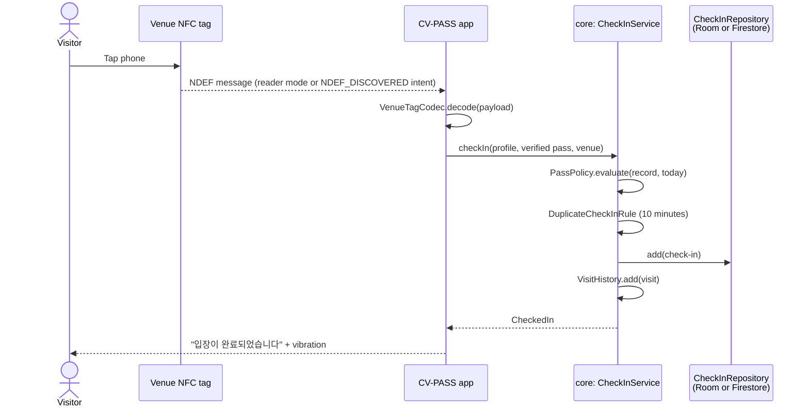
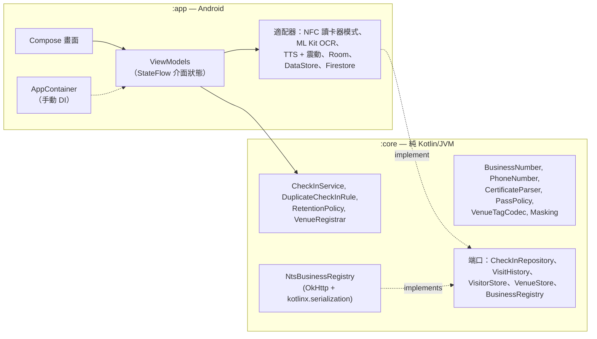

<div align="center">

🇺🇸 [English](README.md) | 🇨🇳 [简体中文](README.zh-CN.md) | 🇭🇰 **繁體中文** | 🇯🇵 [日本語](README.ja.md) | 🇰🇷 [한국어](README.ko.md)


# CV-PASS

**非接觸式 COVID-19 入場紀錄：輕觸場所的 NFC 標籤，出示已核實的疫苗通行證，即告完成。**

[](https://github.com/jumincho/covid-pass-nfc/actions/workflows/ci.yml)
[](LICENSE)
-3DDC84?logo=android&logoColor=white)


</div>

## 概覽

COVID-19 疫情期間，韓國每個場所都必須備存入場紀錄，以便追蹤接觸者；由 2021 年底起，訪客更須出示已接種疫苗的證明。實際上，這就是手寫登記表和二維碼：門口登記費時，姓名和電話號碼亦隨處外露，任人觀看。

CV-PASS 以 NFC 取代這些做法。場所在入口貼上標籤；訪客用手機輕觸標籤，應用程式便會核實其疫苗通行證，並記錄今次到訪。負責追蹤接觸者的人員其後可查閱某日曾到訪某場所的人士。

本應用程式以 Kotlin 及 Jetpack Compose 開發，建基於一個經單元測試、以純 Kotlin 編寫的領域核心：接種證明在裝置上讀取，場所標籤採用設有版本編號的格式，預設設定以私隱為先。毋須任何密鑰即可直接運行；真正的後端可透過設定啟用。

## 功能

### 訪客（Visitor）

- **一次過填寫個人資料**：姓名及韓國手機號碼，輸入時即時驗證並自動套用格式（`010-1234-5678`）。
- **疫苗通行證**（Vaccination pass）：以 Android 相片挑選器選取 COOV 接種證明的截圖（毋須儲存空間權限）。ML Kit 的韓文文字識別模型會在裝置上讀取截圖；解析器從中擷取持有人姓名、接種劑次（`1차/2차/3차 접종`、`추가 접종`）及最後一劑的接種日期，再由判定規則得出「有效」「尚未生效（尚餘 n 日）」或「無效」的結果，並列明原因。只會儲存這些推算所得的資料，絕不儲存圖像。
- **入場登記**：在登記畫面（Check in）開啟時輕觸場所的標籤，或在應用程式關閉時輕觸亦可——標籤會直接開啟應用程式。系統會以語音讀出「입장이 완료되었습니다」（非韓文裝置則為「Check-in complete」）並震動，確認登記成功。10 分鐘內再次輕觸，會視為同一次到訪。最近的登記紀錄（Recent check-ins）會列於通行證畫面。

### 場所東主（Venue owner）

- **商業登記**：輸入號碼（사업자등록번호）時，系統會即時以檢查碼核對。設定了 API 密鑰後，號碼、代表人姓名及開業日期會經國稅廳核實；如未設定，該場所會清楚標示為「未經國稅廳核實」（Not verified with the National Tax Service）。
- **寫入標籤**：將場所資料寫入 NFC 標籤，會格式化空白標籤，並檢查標籤是否可寫入及容量是否足夠；每種失敗情況均有相應的具體訊息。
- **儀表板**：顯示今日訪客人數，並即時更新。

### 檢查員（Inspector）

- **訪客紀錄**：輸入檢查員代碼（Inspector code）後，可查閱某場所任何一日的登記紀錄。清單中的姓名及電話號碼會被遮蓋（`홍*동`、`010-****-5678`）；輕按項目即可顯示詳細資料。

介面會跟隨系統的淺色或深色主題，提供英文及韓文版本，並支援屏幕閱讀器（標題、用作讀出結果的即時區域、附有標籤的控制項）。啟動器圖示設有單色圖層，以配合 Android 13 的主題圖示。

## 截圖

| 角色選擇 | 疫苗通行證 | 登記完成 | NFC 已關閉 |
| :---: | :---: | :---: | :---: |
|  |  |  |  |
| **場所儀表板** | **檢查員查閱紀錄** | **深色主題** | |
|  |  |  | |

這些截圖並非在裝置上擷取，而是在 GitHub Actions 上由 Robolectric 及 [Roborazzi](https://github.com/takahirom/roborazzi) 以示例數據從 Compose 畫面渲染出來；以手動方式執行的 Screenshots 工作流程會重新生成這些截圖。

## 運作原理

場所標籤儲存一則 NDEF 訊息，當中包含兩項紀錄：

| 紀錄 | 內容 |
| --- | --- |
| MIME `application/vnd.jumincho.cvpass.venue` | UTF-8 JSON：`{"v":1,"id":"1248100998","name":"카페 전주"}` |
| Android Application Record | `com.jumincho.cvpass`，使 CV-PASS 即使未有運行，亦可在輕觸標籤時開啟 |

`v` 代表有效負載的版本：讀取端遇到較新的版本時，會以清晰的「請更新應用程式」訊息拒絕處理，而不會錯誤解讀。一般的標籤訊息約為 125 位元組，因此較短的場所名稱可放入 NTAG213 貼紙；應用程式在寫入前會檢查每個標籤的容量。



通行證規則集中在 [`PassPolicy`](core/src/main/kotlin/com/jumincho/cvpass/core/pass/PassPolicy.kt) 一處。它按照韓國在 2021-22 年實施的疫苗通行證規則建模：基礎接種（兩劑，或一劑楊森疫苗）由最後一劑接種後 14 日起生效，加強劑則由接種當日起生效。2022 年 1 月推出的 180 日有效期並未納入模型。

## 架構



- **`:core`** 載有所有重要規則，而且不依賴 Android，因此測試快捷、容易閱讀：值類別在建構時已確保有效，以密封類型表示結果而非拋出例外，而儲存及國稅廳查詢則透過介面（「端口」）進行。
- **`:app`** 是採用類型安全 Navigation 的單一 Activity Compose 應用程式。畫面會渲染來自 ViewModel 的不可變介面狀態（單向數據流）；ViewModel 只依賴 `:core` 的類型及小型介面，因此可用偽物件進行單元測試。NFC、ML Kit、文字轉語音、Room、DataStore 及 Firestore 等 Android 服務，都藏在輕量的適配器之後。
- **依賴注入**以手動方式實現：`Application` 內的 `AppContainer` 一次過建立所有物件，而 ViewModel 則透過 `viewModelFactory { initializer { … } }` 建立。

## 所用技術

| 範疇 | 選用技術 |
| --- | --- |
| 語言及建置 | Kotlin 2.2.21、Gradle 8.14.5（Kotlin DSL、版本目錄）、Android Gradle Plugin 8.13.2、KSP 2.2.21-2.0.5 |
| Android | compileSdk / targetSdk 36、minSdk 26、Java 17 位元組碼 |
| 介面 | Jetpack Compose（BOM 2026.06.01）、Material 3 1.4、Navigation Compose 2.9.8（類型安全路由）、Lifecycle 2.10 |
| 儲存 | Room 2.8.5（訪客紀錄及到訪歷史）、DataStore Preferences 1.2.1（個人資料、通行證資料、場所）；可選用 Cloud Firestore（Firebase BoM 34.19.0） |
| OCR | ML Kit Text Recognition v2，隨應用程式附帶的韓文模型 16.0.1 |
| 網絡 | OkHttp 5.4.0、kotlinx.serialization 1.9.0、kotlinx.coroutines 1.11.0 |
| 測試 | JUnit 6（Jupiter，另加供 Robolectric 使用的 vintage 引擎）、kotlin.test、kotlinx-coroutines-test、Turbine、OkHttp MockWebServer、Robolectric 4.17、Roborazzi 1.75.0 |
| CI | GitHub Actions：測試、Android lint、除錯版 APK、密鑰掃描、Gradle wrapper 校驗和；另有一個以手動方式執行的工作流程負責重新生成截圖 |

較新的 AndroidX 版本（以及 OkHttp 5.5）需要 compileSdk 37 及 Android Gradle Plugin 9.1，而後者需要 Gradle 9；因此版本目錄刻意維持在仍可配合 Gradle 8.14 工具鏈使用的最新一組版本。

## 項目結構

```text
covid-pass-nfc/
├── .github/workflows/                     CI 及截圖工作流程
├── app/                                   Android 應用程式
│   ├── build.gradle.kts
│   ├── schemas/                           匯出的 Room 數據庫結構
│   └── src/
│       ├── main/kotlin/com/jumincho/cvpass/
│       │   ├── AppConfig.kt, AppContainer.kt, CvPassApplication.kt, MainActivity.kt
│       │   ├── data/local/                Room 數據庫及儲存庫
│       │   ├── data/preferences/          以 DataStore 實現的儲存
│       │   ├── data/firebase/             可選用的 Firestore 儲存庫
│       │   ├── nfc/                       讀卡器模式、標籤讀寫
│       │   ├── ocr/                       以 ML Kit 讀取接種證明
│       │   ├── feedback/                  文字轉語音及震動
│       │   └── ui/                        畫面、ViewModel、主題、導航
│       ├── main/res/                      英文及韓文字串、圖示
│       └── test/                          ViewModel 測試及 Robolectric 畫面測試
├── core/                                  純 Kotlin 領域模組
│   └── src/
│       ├── main/kotlin/com/jumincho/cvpass/core/
│       │   ├── business/                  BusinessNumber、國稅廳（NTS）客戶端
│       │   ├── checkin/                   入場登記服務及規則
│       │   ├── inspector/                 檢查員驗證關卡
│       │   ├── pass/                      接種證明解析器及通行證規則
│       │   ├── privacy/                   資料遮蓋
│       │   ├── venue/                     標籤編解碼器、場所登記
│       │   └── visitor/                   電話號碼、姓名、個人資料
│       ├── test/                          單元測試
│       └── testFixtures/                  與 :app 測試共用的記憶體內偽物件
├── docs/
│   ├── presentation.pptx                  2021 年比賽簡報投影片
│   └── screenshots/                       由 Roborazzi 在 CI 上渲染的畫面
├── firebase/firestore.rules               Firestore 後端的示例規則
└── gradle/libs.versions.toml              版本目錄
```

## 開始使用

**系統要求**：JDK 17 或以上版本，以及已安裝平台 36 的 Android SDK（較新版本的 Android Studio 會一併安裝兩者）。入場登記及寫入標籤需要一部支援 NFC、運行 Android 8.0 或以上版本的裝置；在沒有 NFC 的裝置上，應用程式仍可安裝，並會說明這項限制。

```bash
./gradlew :app:assembleDebug      # app/build/outputs/apk/debug/app-debug.apk
./gradlew :app:installDebug       # 需先連接裝置
```

毋須任何設定，全部功能在一部裝置上即可運作：以任何檢查碼有效的號碼（例如 `123-45-67891`）登記場所、寫入標籤、設定訪客資料、核實接種證明截圖、輕觸標籤，然後在檢查員模式下查閱今次到訪。

### 可選設定

可在項目根目錄的 `local.properties`（已被 git 忽略）加入以下任何一個鍵；同名的環境變數亦同樣適用，在 CI 上使用十分方便。

| 鍵 | 啟用的功能 | 未設定時 |
| --- | --- | --- |
| `BUSINESS_API_KEY` | 經國稅廳核實商業登記資料。請使用 data.go.kr 上「국세청_사업자등록정보 진위확인 및 상태조회 서비스」的服務密鑰；編碼及解碼兩種版本均可使用。 | 只會核對檢查碼，而場所會顯示為「未經國稅廳核實」。 |
| `INSPECTOR_PIN` | 檢查員代碼。 | 除錯版本使用 `0000`；正式版本會停用檢查員模式。 |
| `FIREBASE_PROJECT_ID`、`FIREBASE_APPLICATION_ID`、`FIREBASE_API_KEY` | 以 Cloud Firestore 作為共用的訪客紀錄。請從 Firebase 項目的 Android 應用程式設定中取得這些值；由於應用程式以 `FirebaseOptions` 初始化 Firebase，因此毋須 `google-services.json`。 | 登記紀錄會保留在裝置上的 Room 數據庫。三個鍵必須全部設定。 |

使用 Firestore 時，登記紀錄會儲存在 `venues/{businessNumber}/checkins/{id}`，欄位包括 `visitorName`、`phone`、`venueName`、`checkedInAt`、`date`（`yyyy-MM-dd`，用於按日查詢）及 `expireAt`。應用程式沒有實現 Firebase Authentication，因此只能配合容許未經驗證存取的規則使用——用於即棄的測試項目尚可，但不適用於真實資料。[`firebase/firestore.rules`](firebase/firestore.rules) 展示了正式環境所需的規則：經驗證的訪客只能追加格式正確的紀錄，檢查員以可信伺服器設定的自訂聲明識別，不容許客戶端更新或刪除，並對 `expireAt` 設定 TTL 政策以控制保留期。

## 測試

```bash
./gradlew :core:test                 # 領域規則、解析器、編解碼器、NTS 客戶端
./gradlew :app:testDebugUnitTest     # 使用記憶體內偽物件的 ViewModel 測試、Robolectric 畫面測試
./gradlew :app:lintDebug             # Android lint，警告視作錯誤
./gradlew :app:recordRoborazziDebug  # 重新生成 docs/screenshots
```

- **`:core`** 的單元測試涵蓋：商業登記號碼的檢查碼演算、電話號碼及姓名驗證、資料遮蓋、接種證明解析器（大量含雜訊、換行、全形字元及混合日期格式的合成 OCR 文字）、通行證規則的邊界情況、標籤編解碼器（來回轉換及格式錯誤的有效負載）、重複登記及保留期規則、入場登記服務，以及以 OkHttp MockWebServer 測試的 NTS 客戶端（有效、不相符、密鑰被拒、伺服器錯誤、回應內容格式錯誤、逾時、取消）。
- **`:app`** 為每個 ViewModel 編寫了 JVM 單元測試，並以 `:core` 測試夾具中的記憶體內偽物件及 kotlinx-coroutines-test 驅動；另有 Robolectric 測試，以示例數據渲染五個畫面並檢查其主要內容。以 `recordRoborazziDebug` 執行時，同一批測試會生成上方的截圖；Screenshots 工作流程以手動方式啟動後，會在 CI 上完成這一步，並提交所有有變更的圖像。
- 每次推送及拉取請求時，CI 都會執行測試、lint 及除錯版建置。

NFC、ML Kit、文字轉語音及 Firestore 適配器只是平台 API 的輕量封裝，並沒有自動化測試；它們需要具備相應硬件及服務的裝置。本應用程式已通過上述單元測試、lint 及建置的驗證；但仍未在實體裝置上配合 NFC 標籤進行端對端測試。

## 私隱與安全

- **接種證明只會留在裝置上**。OCR 以 ML Kit 內置的模型在本機執行；圖像及其文字在解析後即會棄置。只會儲存已接種劑數、基礎接種所需劑數、最後一劑的接種日期及核實時間。
- **盡量減少紀錄**。一項登記紀錄只包含訪客的姓名、電話號碼、場所及時間——正是追蹤接觸者所需的資料。檢查員看到的清單會遮蓋姓名及號碼，直至打開某個項目為止。
- **保留四星期**。2021 年韓國的指引是入場紀錄須於四星期後銷毀。應用程式每次啟動時都會刪除超過 28 日的登記紀錄及到訪紀錄；使用 Firestore 時，`expireAt` 欄位供伺服器端的 TTL 政策使用。
- **不備份個人資料**。應用程式數據的雲端備份及裝置之間的轉移均已停用。
- **檢查員代碼只是示範用的驗證關卡，並非存取控制**。代碼編譯在應用程式之內，可被提取出來，APK 內的任何 API 密鑰亦然。真正部署時，應在伺服器上驗證檢查員身份、把國稅廳密鑰放在後端之後，並依靠 Firestore 規則、Authentication 及 App Check。
- **OCR 並不等於證明**。讀取截圖無法識別經修改的圖像；COOV 應用程式本身的二維碼驗證並未實現。通行證檢查只是展示流程，並非可信的憑證核實。

## 獎項與團隊

CV-PASS 是全北國立大學（JBNU）的團隊項目。本項目獲頒 **2021 年全北國立大學（JBNU）電腦科學系學生作品比賽銀獎**（2021 年 11 月 26 日）。

| 所屬單位 | 角色 | 姓名 | 負責範疇 |
| --- | --- | --- | --- |
| JBNU | 組長 | Lee Jeonghwan | 開發 / 設計 |
| JBNU | 組員 | Kim Yeonho | 開發 / 設計 |
| JBNU | 組員 | Jeong Jaeyoung | 開發 / 設計 |
| JBNU | 組員 | Cho Jumin | 簡報 / 設計 |

- 比賽簡報：[2021 年全北國立大學（JBNU）電腦科學系學生作品比賽（YouTube）](https://www.youtube.com/watch?v=LHE4dr8aTKQ&list=PLFAjt9goCKzyHfSKoV9AnDuxl1U9w1mLL&index=13)
- 投影片：[`docs/presentation.pptx`](docs/presentation.pptx)

## 授權

源代碼以 [MIT 授權條款](LICENSE)發布。簡報投影片（`docs/presentation.pptx`）仍由團隊共同擁有。
